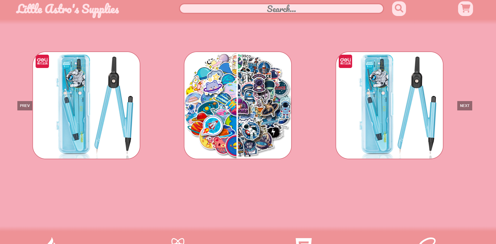

# E-Commerece

## Description

-   A storefront for space themed stationary, decided to change the look from the usual dull dark gray theme to a more warm welcoming pleasent pink
-   Website connects to firebase data base allowing for users to 'purchase' products, including quantity, variants and more!

## Preview




## Setup

-   Simply use the following commands
-   To install

```
npm install
```

-   To run the page, like any other react website

```
npm start
```

## Developer Notes

### Issues that accured

-   during the later stage of development while creating the cart itself, i came across an issue i had not thought of, is that my session storage was being used to preload all items and use whenever i pleased, this did not leave another category for me to use for all items added which needed their own sort of sub cateogry for all added carts, and so I had to create 2 SessionStorage key arrays, one for cart items and preloaded items

-   Due to time constraints, the way the functions that are responsible for adding and removing quantity from the cart are set up is that is directly adds to the referance rather than adding and returning a new instance. Will need to be either fixed later or to be reminded in the future as this will inevitably cause bugs and issues, as a result the values in the tests are new each time to prevent previous tests adjusting the future tests

### To Do Later - Time Constraint Passed

-   Have an extra tab on the website to allow for adding more items, possibly with an admin username and password system, to allow easier use rather than going into firebase and manually adding items which is a huge pain
-   On the Carosel, there is a chance for duplicate items of the same type and variant, due to time constraints, couldnt make it in time but later down the line i may fix this, another reason this wasnt priority is because the more items made, the less chance this will happen
-   Have Database have a quantity amount, so as to notify users that the item has been sold out etc, would need to revamp alot of code to get this done, not only that but allow uploaders the option to add items easily, so the above would need to be done aswell
-   I needed to create tests for variant addition and subtraction, but again, not enough time, so for now they are in the Cart.jsx file rather than the /services/cart.js

### Inner Workings Simplified

-   Upon loading the website to its store front, all possible items found inside of the firebase database will be saved into the sessionStorage to prevent any lag, now on a large scale this would only be done for selected items, but due to the nature of the project ive just preloaded the entire database for simplicity sake.
-   Once a request is placed to recieve an object either by getting all of them or by id, a JSON parse is completed to load back all of the pre-rendered items
-   Items added will be loaded in another session storage for cart items, upon loading into the cart tab, will load this session storage and any changes to the variants quantity will also save to that session storage
